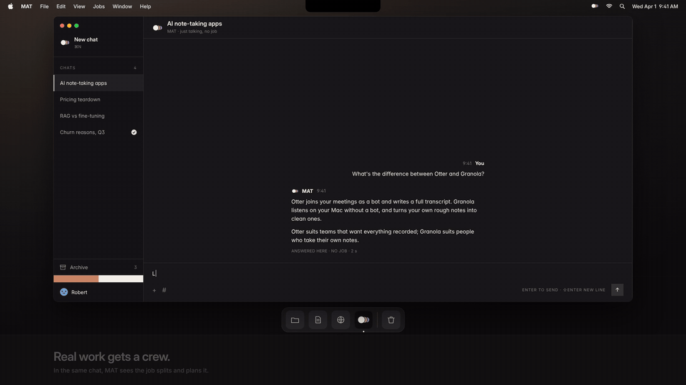
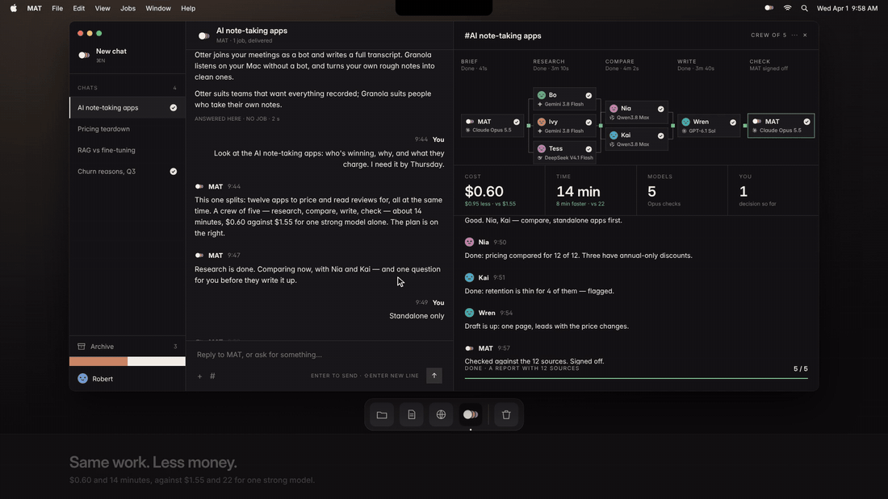
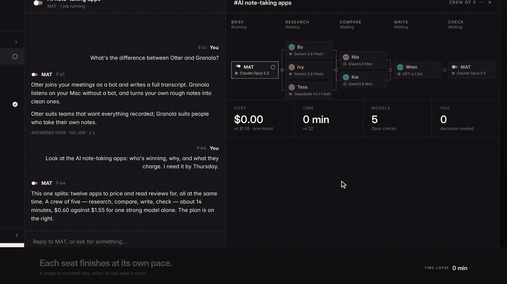
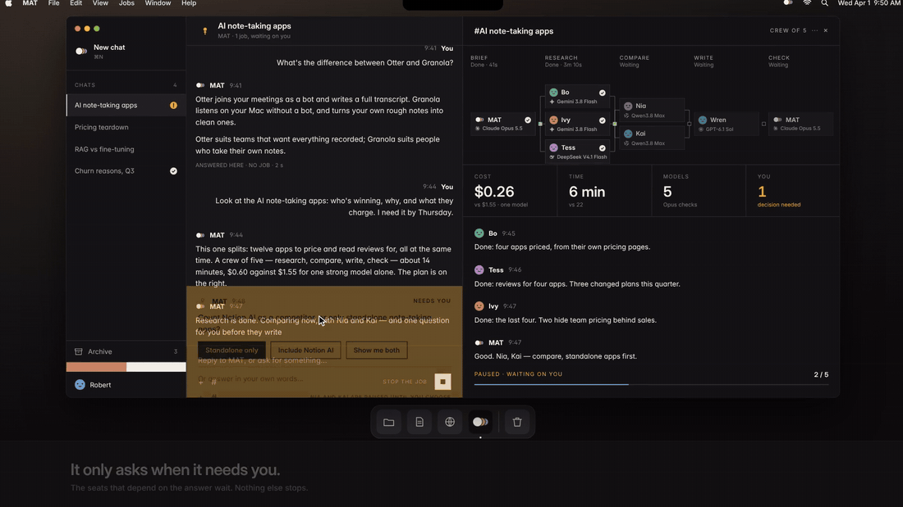
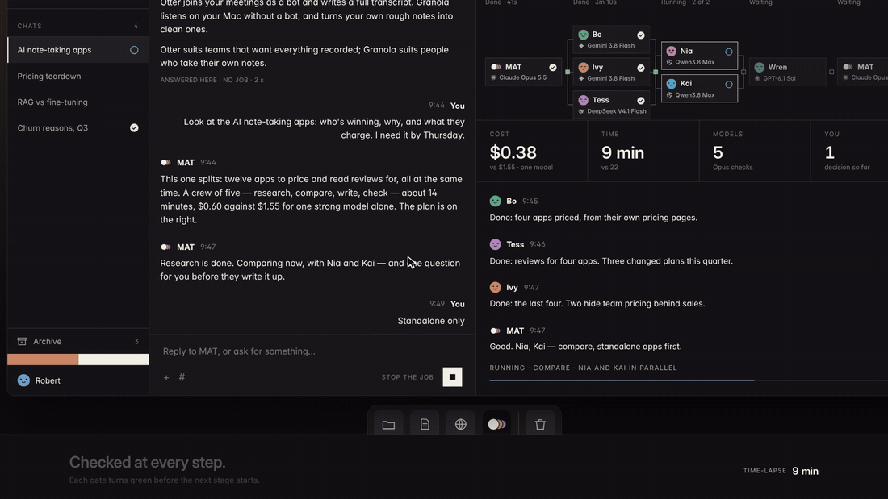
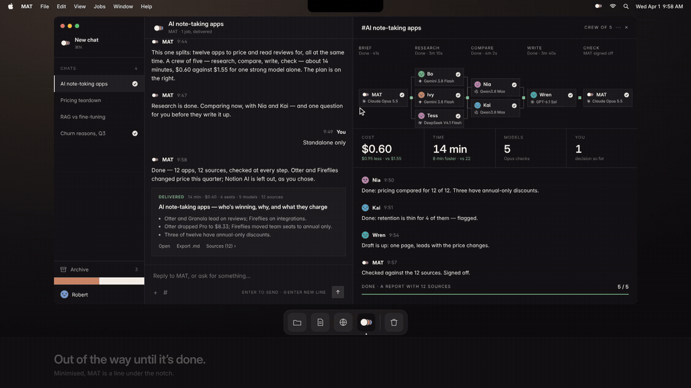

# MAT

**Ask once. MAT decides.** MAT is one chat for every AI you already pay for, running on your own computer. A question gets an answer. A job gets one model — or, when the work splits, a crew, checked at every step.



<sub>Every card says which model that seat runs on.</sub>

⬇️ **Free beta for Mac: [Download MAT-macOS.zip](https://github.com/RobertLeeHao/MAT/releases/latest/download/MAT-macOS.zip)** · macOS 13 or later · Apple silicon and Intel · [how to open it](#get-the-beta)

💬 **Talk to us: [Discussions](https://github.com/RobertLeeHao/MAT/discussions)** — ideas, questions, and the first job you'd hand MAT. Something broke? [Open an issue](https://github.com/RobertLeeHao/MAT/issues/new/choose).

🌐 Website: <https://robertleehao.github.io/MAT/> (soon <https://askmat.app>)

This repository is MAT's website — one self-contained [`index.html`](index.html) — and where the beta is released and discussed. The app's source code lives in a separate, private repository; its builds are published here as [releases](https://github.com/RobertLeeHao/MAT/releases).

## Get the beta

1. Download [`MAT-macOS.zip`](https://github.com/RobertLeeHao/MAT/releases/latest/download/MAT-macOS.zip), double-click it, and drag **MAT** into Applications.
2. Open MAT once. The beta isn't notarized by Apple yet, so macOS says it can't check it — click **Done**.
3. Open **System Settings › Privacy & Security**, scroll to Security and click **Open Anyway** next to MAT, then enter your password. (The button is there for about an hour after you tried.)
4. In MAT, **Settings › Providers › Add provider…** — connect the AIs you already pay for, or Ollama on your own computer.

Updating: replace MAT in Applications with the new build; your chats, memory and keys stay. Please never paste an API key into an issue or a discussion.

---

## 1. What MAT is

MAT is a desktop app. You only ever talk to it, the way you would in any AI chat app: chats on the left, the conversation in the middle, the input at the bottom. The difference is what sits behind it — not one model, but every model you have: Claude, ChatGPT, Gemini, DeepSeek, Kimi, Qwen, Z.ai, Mistral, Grok, MiniMax, OpenRouter, Groq, Cerebras, and local models on your own computer.

MAT reads every message first and makes one of three calls:

| You ask | MAT decides | You get |
|---|---|---|
| A question — "RAG or fine-tuning for our support bot?" | Answers it, right here in the chat | An answer · seconds · no job |
| Something one model can finish — "Draft the launch email for the October release. Under 200 words." | Writes it on one model and checks it before you see it | A draft, ready to send · 52 s · $0.004 · one model |
| Work that splits — "Look at the AI note-taking apps: who's winning, why, and what they charge." | Twelve apps at once: six scouts, two to compare and one to write, each on the model that suits its step, with MAT planning and checking every stage | A report with 12 sources · 14 min · $0.60, against $1.55 on one strong model · 9 seats · 5 models · 5 checks |


<sub>Work that splits gets a crew instead — the clip at the top.</sub>

When a message could go either way, MAT asks one question first — and only when the answer changes how the work gets done.

"MAT" is both the product and the only one you talk to. The crew works in a drawer beside the chat; look when you want to.

## 2. The problem it solves

You already pay for several AIs. Getting real work out of them is still your job — and it breaks in four places:

- **You run the workflow.** You pick a model for every step, paste the context from one chat into the next and keep track of who said what. *Costs you your time.*
- **Nothing carries over.** Each model remembers only its own chats. Switch tools or hit a limit, and the context — and what you taught it — is gone. *Costs you the context, at every switch.*
- **One model does everything.** A strong model is slow and expensive on the easy steps. A cheap one gets the hard steps wrong. *Costs you money, or quality.*
- **Nobody checks the work.** A mistake in one step flows into the next. Finding it, and redoing what was built on it, is up to you. *Costs you rework.*

MAT's bet: **process beats raw IQ.** Most AI work doesn't need the smartest model. A sound workflow, complete instructions and a check after every step decide quality more than any single model does. So strong models work only where judgement matters — the plan and the sign-off — and small, fast models do the steps in between, side by side.

And it's honest about the limits: **not every job gets both.** A short job is cheapest on one model, and work that can't split doesn't get faster. MAT gives its estimate before it starts and runs the job the cheaper way.



<sub>The same note-taking job, delivered with 12 sources.</sub>

## 3. How it works

```
You ──▶ MAT (decides)
          ├─ a question ──────────────▶ answers it in the chat
          ├─ could go either way ─────▶ one question, with 2–3 quick replies
          ├─ one model can finish it ─▶ one seat → check → deliver
          └─ the work splits ─────────▶ 2–5 stages, 1–3 seats each, every seat staffed from the ranking
                                          ▼
                                       stage 1 ──gate──▶ stage 2 ──gate──▶ … ──▶ MAT signs off ──▶ delivered
                                          │
                                          └── a decision that's yours: MAT's question takes the place of the
                                              input, and the seats that depend on it wait until you choose
                                                                          │
                                     a job delivered clean is written down by kind of work ──▶ the next job of that kind starts from it
```



<sub>Time-lapse: Bo hands in first; the stage waits for its last seat before MAT checks it.</sub>



<sub>Answer with one click, or in your own words.</sub>

- **The right model for every seat.** MAT keeps an official ranking of 37 models in nine categories, named and scored the way Arena and Artificial Analysis do it. Six of them staff seats — Agents, Search, Reasoning, Writing, Factuality, Image generation; Coding, Instruction following and Vision are for reference. Research seats are picked by Search, writers by Writing, checkers by Factuality.
- **A gate after every step.** Each stage passes MAT's check before the next one starts, so nothing downstream is built on a mistake. A failed check can't be overruled by MAT's sign-off. Results come with sources; when MAT can't find one, it says so instead of answering from memory.

  

  <sub>The gate between two stages turns green only after MAT's check.</sub>

- **Relay between models.** If a model fails, the next one takes the seat; a provider whose allowance has run out is skipped; a retired model is replaced with one of the same tier.
- **Spending under control.** Before a job runs, MAT estimates its time and cost next to one strong model's. If the crew would cost too much, MAT shrinks it to one model. You set a cap per job.
- **Memory that's yours.** When a job is delivered clean, MAT writes down what worked — by kind of work, not by chat and not by person — on your computer. The next job of that kind starts from it, on whichever model. Deleting a chat never deletes it; only Settings › Memory does.
- **Out of the way until you're needed.** Minimised, MAT is one still line at the top of the screen — under the notch on a Mac — a segment per chat: blue while it thinks or works, amber when it needs you, red if it stopped, green when it's done and you haven't looked.

  

  <sub>Hover the line to see each chat and where it stands.</sub>

## 4. How MAT differs

| | MAT | A typical AI product |
|---|---|---|
| Chats | Each kind of job leaves a way of doing it; the next one starts from there | Every chat starts from zero |
| Memory | On your computer; switch models and nothing is lost | A vendor feature you can't take with you |
| Setup | Say what you need; MAT picks the seats, the models and the process | Templates, prompts and flows you maintain yourself |
| Who you talk to | MAT, in one chat | More agents, more tabs |
| Cost | Strong models only plan and check; the bigger the job, the more it saves | Every step on the expensive model |
| Parallel work | Several seats on one job at once; several chats at once | One linear conversation at a time |
| Quality | A gate at every stage; results come with sources | Checking is your job |
| Interruptions | Only when a decision is yours | You sit and watch the window |
| Providers | All your subscriptions on one crew; one runs out, MAT moves on | One vendor; when you hit the limit, you stop |

MAT is **not** a chat client, **not** an editor for hand-drawn workflows, and **not** an autonomous agent that disappears for an hour. It's a chat that decides.

## 5. Privacy

MAT has **no account and no server of its own.** It runs on your computer and calls the models you connect directly, with your own keys.

- **Stays local.** Chats, projects, the queue and what MAT learns are saved on your computer; finished work lands in Documents › MAT.
- **Need to know.** Each model sees only its step: a scout gets the pages it reads, not your history; the writer gets the findings, not your other chats.
- **Your keys stay on your computer.** In a file only your account can read, with a copy in your keychain. Each key goes only to the provider it belongs to.
- **Honest note.** Each step's text goes to the provider whose model runs it, under that provider's terms. For work that mustn't leave your computer, connect a local model and MAT can run the whole job on your own machine, web searches aside.

We don't hold anything about you: no account, no email list. Downloads and discussions happen on GitHub, under GitHub's terms.

## 6. The website

The first screen is just the claim, one sentence and the two ways in: **Download for Mac** and **Discuss on GitHub**. Scroll, and a one-take demo film rises from below (32 seconds, ending as MAT shrinks back under the notch; files in `media/`): the frame's own edge covers the first screen, grows to the full width of the window and starts playing. Scroll on and 01 slides up over it while the film steps back, dims and pauses.

| # | Section | What it says |
|---|---|---|
| 00 | See it work | The demo film, one take |
| 01 | The problem | Many models, no team — four problems, each with what it costs you |
| 02 | The answer | One chat, every model, one memory: a diagram that rewires as you scroll, from "you, between six apps" to one chat, one memory and a gate after every step |
| 03 | MAT decides | It answers, does it, or staffs it — the three calls, with the crew marked as where MAT is strongest |
| 04 | What it saves | One example, a competitor analysis of 12 apps done three ways: 61% less spent than one strong model, 8 minutes sooner, 12 of 12 claims holding up (cheap models only: 9) — and why not every job gets both |
| 05 | Why it works | Process beats raw IQ: strong models plan and check, seats run side by side, gates stop rework |
| 06 | How it works | Start to finish in one chat, in four steps; the window beside them frames only the part each step is about |
| 07 | Models and memory | Every AI you pay for, working as one crew: one job's seats sitting on the subscriptions they run on, what each has left this cycle, and MAT's local memory |
| 08 | Privacy | Your work never passes through us |
| 09 | The ranking | Every model, ranked for every kind of work |
| 10 | Dock | Out of the way until you're needed |
| 11 | Coming soon | The next four things (below) |
| 12 | Questions | Six questions, answered |
| 13 | Get the beta | Try it. Tell us what breaks. — the same two buttons |

- **Motion.** There is one motion design for everyone: the page moves, with a few scroll-driven scenes, and stands still when the system's Reduce Motion setting is on. For review, `?motion=quiet`, `?motion=bold` or `?motion=loud` forces a level. Press **G** (or add `?grid`) to see the 12-column grid every element sits on.
- **Phones and tablets.** Below 861 px, and on any portrait screen up to 1199 px, the page is one column: the film sits in the flow at the grid's width instead of pinning and growing. On phones (≤ 699 px) it's one calm column — nothing pinned, the questions fold, and tapping the film plays it full screen.
- **Footer pages.** Get the beta (how to open it), Changelog, About, Privacy, Terms and Contact open as one sheet over the page, each with its own shareable link (`#install`, `#changelog`, `#privacy`, …); Esc or Close shuts it. Privacy and Terms are short beta versions; Contact points to Discussions and to the issue forms.
- **Download button.** It always points at `releases/latest/download/MAT-macOS.zip`. The version and size under it come from `MAT_SITE.beta` in `index.html`, which `release.sh` in the app repository writes when it publishes a build; with no build out yet, the button opens the releases page instead.
- **Numbers.** The times and costs on the page are illustrative, worked out from each provider's public list prices (September 2026), until measured runs replace them. MAT shows the real comparison on every job.

## 7. Technical notes

- **One file.** CSS and JS are inline. The only external dependency is [Lenis](https://github.com/darkroomengineering/lenis) from jsDelivr, for smooth scrolling; the page works without it.
- **Brand marks.** An inline SVG sprite at the top of `<body>` holds 21 `<symbol id="lg-…">` marks on one 24 grid at the same optical size, drawn in the text's colour (`fill: currentColor`). Subscriptions and products use product marks (Claude, ChatGPT → OpenAI, Gemini…); the ranking uses maker marks. Sources: LobeHub Icons (MIT), Simple Icons (CC0), svglogos.dev (CC0), Lucide (ISC). The trademarks belong to their owners: Microsoft (Copilot) requires written permission, and Google, Meta and MiniMax require approval first — get it before a public launch, or remove the `<symbol>` and its id in `MODELS` / `MKLG`, and that spot shows text only.
- **No build step, no cookies.** Visits aren't counted (Cloudflare Web Analytics is wired but off: its token goes in `MAT_SITE.beacon`, and it only loads on askmat.app). Download clicks are counted: each click on a Download button adds one to a public counter on Abacus (`MAT_SITE.clicks`, once per kind per page load, never when the browser sends Do Not Track / GPC); GitHub counts the zip downloads itself. `sh stats.sh` prints both. Nothing is stored in the browser (the keys an older version left behind are cleared on load).
- **Hosting.** Static files only: GitHub Pages now, Cloudflare (`wrangler.jsonc`, assets only — no Worker code, no database, no secrets) once askmat.app is live. `.assetsignore` makes sure only the page and its public images are served. The waitlist Worker from v3.4 is kept, unused, in `archive/waitlist-worker/`. Setup: [`SETUP.md`](SETUP.md).
- **GitHub.** `.github/ISSUE_TEMPLATE/` has two forms (a bug in the beta, a crew for your company) and sends ideas and questions to Discussions; `.github/DISCUSSION_TEMPLATE/` has the forms for Ideas and Use cases.
- **README clips.** `readme/01–07-*.gif` are cut from the demo film along its own captions (1100 px wide, 15 fps, 0.9–3 MB each), so each clip carries its title; the line under each one adds what the clip shows. They are not deployed with the site (`.assetsignore`).
- **Share card and icons.** `og.png` (2400 × 1260), `favicon.svg`, `favicon-32.png`, `apple-touch-icon.png`; social assets (GitHub social preview, X header and avatar, a build-log post template) in `social/`.
- **Preview locally.** Open `index.html` in a browser.
- **Publish.** `sh publish.sh` commits and pushes to GitHub; once the repository is connected to Cloudflare, every push redeploys askmat.app. `.github/workflows/pages.yml` publishes the page, its images and `media/` to the GitHub Pages address.

## 8. Status

MAT is in an open beta, free while it lasts: anyone can [download it](https://github.com/RobertLeeHao/MAT/releases/latest). The app's source code is not public; builds are released here.

## 9. What's next

**Coming soon**

1. **Your computer is the server. Every device can call it.** MAT runs a small server on the computer it lives on. Your phone, a tablet or another computer — any system, any browser — hands it work, answers its questions and picks up the results.
2. **MAT as a bot in your chat apps.** Add MAT to Slack, Telegram, WhatsApp or Lark. Hand over a job in a message; the question and the result come back in the same thread.
3. **Build your own crew. Then share it.** Set the seats, the model on each and the checks for work you do often, and keep it as your crew. Share it, or start from one someone else built — it runs on your own models.
4. **Crews built for your company.** Company work is bigger and repeats: the same reports, reviews and research every week. We'll build a crew for one of your workflows — strong models where judgement matters, cheap ones for the volume — so the savings grow with every run, on your own machines and keys. [Tell us about your workflow](https://github.com/RobertLeeHao/MAT/issues/new?template=company.yml).

**Also on the list**

- Recommend which subscription to add, from the seats it would fill for the work you do.
- Sign in with your ChatGPT or Claude plan directly; add the same provider twice, for a work and a personal account.
- Rebuild the ranking automatically every week, and show you before a seat changes model.
- Memory that keeps calibrating, from your ratings, from rework and from every call MAT makes.
- An open format: export your ways of working and your memory, and take them with you.
- Privacy routing per step: sensitive steps go only to local models.

## 10. Design principles

- **You only talk to MAT.** However complex the workflow, it never becomes complexity in the conversation.
- **Each colour means one thing.** Blue: running. Amber: needs you. Green: passed or done. Red: something went wrong.
- **Honest numbers.** Every job is compared with one strong model; when the crew costs more, MAT says so, and small jobs get one model.
- **It doesn't pull you away.** When MAT needs you, the question appears where that chat's input was; it never switches the chat you're reading.
- **Swiss layout.** A 12-column grid, very large titles over small text, left-aligned, flat colour; illustrations only where they explain.

---

© 2026 Robert Lee. All rights reserved.
